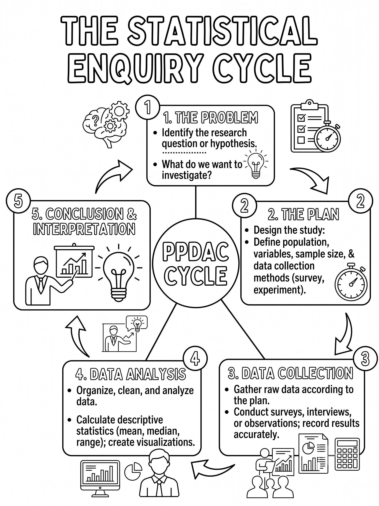

# The Statistical Enquiry Cycle (PPDAC) {#sec-ppdac}

```{r}
#| label: ppdac-setup
#| include: false

source("../book-support.R")
```



New Zealand's statistics curriculum uses the **PPDAC cycle** as the framework
for carrying out statistical investigations and interpreting statistical
information.

| Stage | What you do |
|-------|-------------|
| **P**roblem | Pose a statistical question |
| **P**lan | Plan how to collect data |
| **D**ata | Collect and record data |
| **A**nalysis | Explore and summarise the data |
| **C**onclusion | Interpret results and answer the question |

```{r}
#| label: ppdac-diagram
#| fig-cap: "The PPDAC cycle: a framework for statistical investigations."
#| echo: false

draw_ppdac_cycle()
```

::: {.callout-tip}
## Why PPDAC matters in both standards
- In **AS1.1**, you carry out the full cycle yourself.
- In **AS1.3**, you often interpret someone else's data and reasoning.
- In both cases, you still need a clear question, evidence, and a conclusion in context.
:::

## Stage-by-stage guidance

### Problem

Write a statistical question that expects variability and identifies a clear
context, variable, and population.

### Plan

Decide how data will be collected, how the sample will be selected, and how
fairness and bias will be managed.

### Data

Collect and record the data accurately, with units and labels that can be
interpreted later.

### Analysis

Use graphs and summary statistics to identify patterns, centre, spread, and
interesting features.

### Conclusion

Answer the original question in context, using evidence from the analysis and
acknowledging any limitations.

## Common PPDAC mistakes

- Starting analysis before writing a clear statistical question.
- Using a sample that is large but biased.
- Reporting numbers without units or context.
- Giving a conclusion that does not answer the original question.

## Quick check

1. Which PPDAC stage is most closely linked to reducing sampling bias?
2. Which stage should include comparison language and evidence from graphs?
3. Why must the conclusion link back to the original question?

::: {.callout-note .content-visible collapse="true" when-format="html"}
## Answers
1. **Plan**.
2. **Analysis** (with final interpretation carried into **Conclusion**).
3. Because PPDAC is question-driven, so conclusions must directly answer the statistical problem in context.
:::
